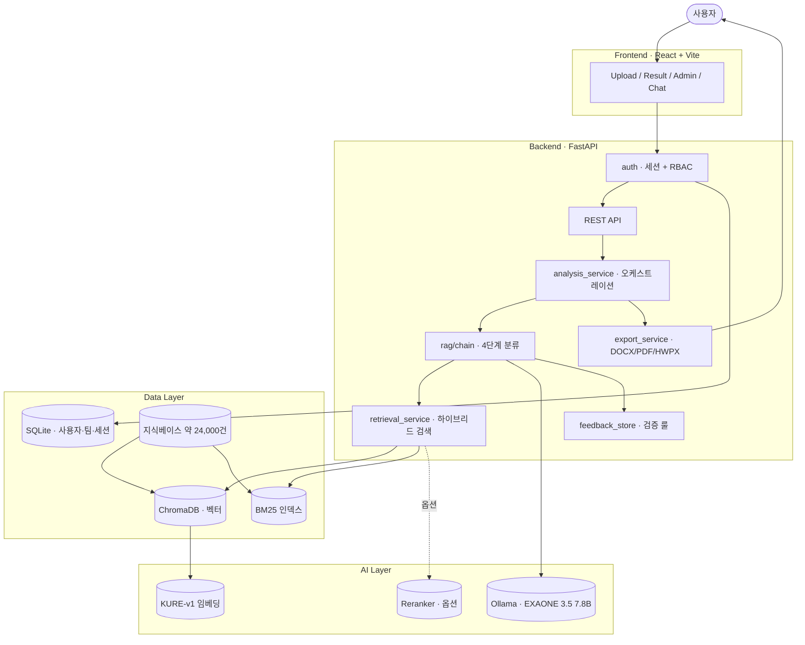
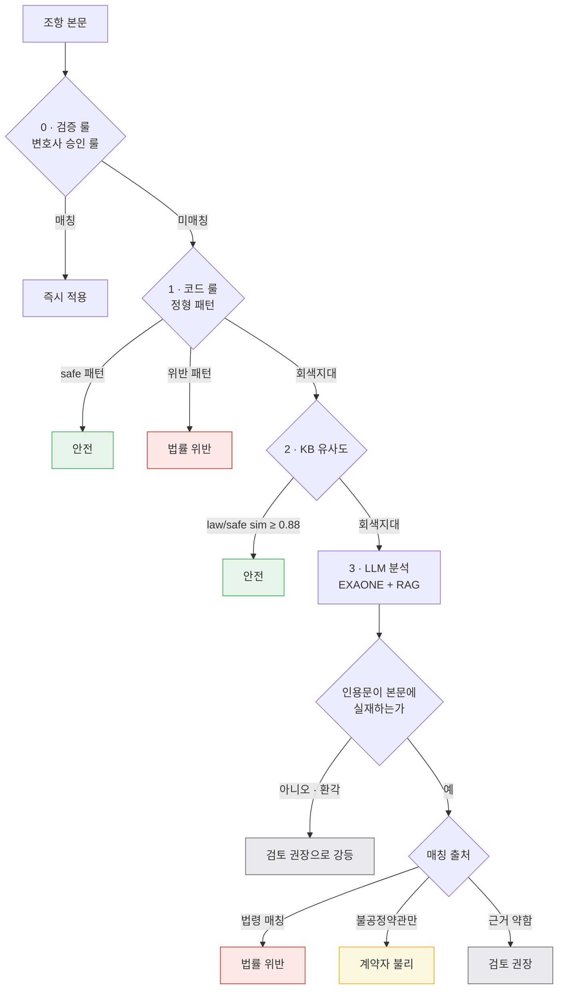
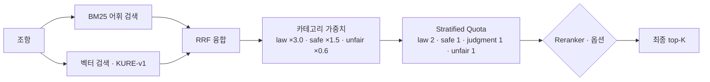
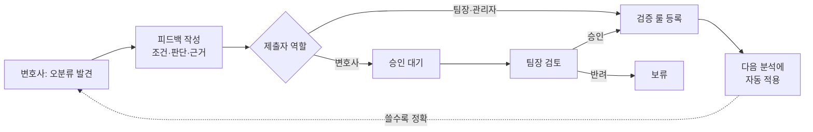

# ARGOS

**로컬 LLM과 RAG 기반의 한국어 계약서 위험 분석 시스템**

ARGOS는 외부 API 호출 없이 폐쇄망에서 동작하는 계약서 검토 도구입니다. PDF · DOCX · HWP · HWPX 계약서를 업로드하면 조항을 자동으로 분리하고, 각 조항의 위험도를 네 단계로 분류한 뒤 관련 법률 · 판례 · 표준약관 근거와 함께 수정안을 제시합니다. 그리스 신화에서 백 개의 눈으로 한순간도 빠짐없이 감시하던 거인 *Argos*에서 이름을 따왔습니다.

법무 환경의 두 가지 제약 — **계약서 외부 유출 금지**와 **판단 근거의 추적 가능성** — 에서 출발해, 모든 추론을 로컬에서 수행하고 모든 위험 판정에 법률·판례 출처를 명시하도록 설계했습니다.


---

## 문제 의식

계약서 검토에 범용 LLM을 그대로 쓰기 어려운 이유가 있습니다.

- **보안** — 법무법인·금융기관은 계약 내용을 외부 API로 보낼 수 없습니다. 클라우드 LLM은 선택지에서 제외됩니다.
- **환각** — 로컬에서 돌릴 수 있는 소형 모델(7.8B)은 근거 없는 위험을 지어내거나, 표면적으로 비슷한 조항을 잘못 판정합니다.
- **신뢰성** — 변호사가 결과를 업무에 쓰려면 "왜 위험한가"가 법률·판례로 추적되어야 합니다. 점수만으로는 부족합니다.
- **개선의 한계** — 폐쇄망에서는 더 큰 모델로 교체하거나 외부 API를 붙여 정확도를 올리는 길이 막혀 있습니다.

ARGOS는 이 네 가지 제약을 각각 로컬 추론, 다단계 검증, 출처 기반 분류, 전문가 피드백 학습으로 해결합니다.

---

## 설계상의 선택

| 영역 | 일반적인 RAG 구현 | ARGOS |
|---|---|---|
| 검색 | 단일 벡터 검색 | BM25 + 벡터 하이브리드, RRF 융합, 카테고리 stratified quota |
| 분류 | LLM 단독 판정 | 검증 룰 → 코드 룰 → KB 유사도 → LLM 4단계 캐스케이드 |
| 신뢰성 | 점수만 표시 | LLM 인용문의 본문 substring 검증 — 근거 없으면 등급 강등 |
| 위험 등급 | 위험/안전 2분류 | 법률 위반 / 계약자 불리 / 검토 권장 / 안전 (대응 기준 4단계) |
| 등급 결정 | 유사도 점수 | 매칭된 근거의 출처(법령 vs 불공정약관)로 결정 |
| 정확도 개선 | 모델 교체·외부 API | 변호사 피드백을 검증 룰로 누적하는 자가 학습 |
| 데이터 보안 | 외부 API 호출 | 완전 로컬 — 외부 송출 없음 |

내부 검증(임대차 538건) 기준 정확도 99.1%, 거짓 경보 0건.
다만 이 수치는 동일 도메인 검증셋 기준이며, 실무 OOD 성능은 별도 평가가 필요합니다.

---

## 아키텍처



---

## 조항 분석 파이프라인

각 조항은 위에서 아래로 계층을 통과하며, 상위에서 판정되면 즉시 종료합니다. 명확한 조항은 LLM을 거치지 않아 빠르고 일관되며, LLM 호출은 회색지대로만 한정됩니다.



### 1. 입력 처리
업로드된 파일에서 텍스트를 추출(`document_service`)하고, 키워드 분석으로 계약 유형 5종을 자동 감지합니다. 임대차는 주택/상가 세부 유형까지 구분해 적용 법령(주임법/상임법)을 분기합니다. 본문은 `제N조` 패턴으로 조항을 분리하되, 특약사항은 먼저 떼어내 `1.`·`①`·`가.` 단위로 재분할합니다(`clause_service`).

### 2. 하이브리드 검색
조항마다 의미 기반(KURE-v1 벡터)과 어휘 기반(BM25) 검색을 동시에 수행하고 RRF로 결합합니다(`retrieval_service`).



지식베이스는 판례 72% · 법령 11%로 분포가 치우쳐 있어, 단순 검색으로는 정작 판단 기준인 법조문이 상위에 들어오지 못합니다. 이를 카테고리 가중치(법령 ×3.0)와 stratified quota(법령 최소 2건 보장)로 이중 보정해, 어떤 조항이든 법적 근거가 항상 검색 결과에 포함되도록 했습니다. 벡터·BM25 점수는 척도가 다르므로 직접 더하지 않고 순위 기반 RRF로 융합하며, 한쪽에서만 잡힌 매칭에는 패널티를 적용합니다.

### 3. 4단계 분류
검색 결과를 근거로 계층적으로 판정합니다(`rag/chain`).

- **0단계 — 검증 룰**: 변호사가 등록하고 팀장이 승인한 룰과 비교. 조건 키워드 일치와 본문 유사도(bigram 자카드 ≥ 0.5)를 모두 만족하면 변호사 판단을 그대로 적용합니다.
- **1단계 — 코드 룰**: 법정 한도 초과 등 결정적 패턴을 정규식으로 즉시 분류합니다.
- **2단계 — KB 유사도**: 법령·표준약관과 유사도 0.88 이상이면 안전으로 확정합니다.
- **3단계 — LLM**: 위 단계로 결정되지 않은 회색지대 조항만 EXAONE이 RAG 근거를 바탕으로 추론합니다.

### 4. 검증과 등급 확정
LLM 판정은 그대로 신뢰하지 않고 두 단계로 검증합니다(`analysis_service`).

- **환각 차단**: LLM이 위험 근거로 인용한 문구가 조항 원문에 실제로 존재하는 substring인지 검증합니다. 본문에 없으면 지어낸 것으로 보고 검토 권장으로 강등합니다.
- **출처 기반 등급**: 위험도를 유사도 점수가 아니라 매칭된 근거의 출처로 결정합니다. 법령에 매칭되면 법률 위반(HIGH), 불공정약관에만 매칭되면 계약자 불리(MEDIUM), 근거가 약하면 검토 권장(LOW)으로 나눠 위법성과 단순 불리함을 구분합니다.

추가로, 임베딩이 문장을 평균 내는 특성 때문에 "정상적인 도입부 + 위험한 결말" 형태의 조항이 정상으로 오판되는 문제가 있었습니다. 조항의 앞·뒤를 나눠 각각 유사도를 측정하고, 앞만 일치하고 뒤가 다르면 패널티를 부여해 이 false positive를 차단합니다.

---

## 자가 학습 — 전문가 피드백 루프

폐쇄망에서는 모델 교체나 외부 API로 정확도를 올릴 수 없습니다. ARGOS는 대신 변호사의 검토 결과 자체를 학습 신호로 활용합니다.



변호사가 잘못 분류된 조항에 올바른 판단을 등록하면(조건·판단·근거·일반화 여부), 팀장 승인을 거쳐 검증 룰로 누적됩니다. 이후 같은 패턴의 조항은 LLM을 거치지 않고 등록된 판단으로 즉시 분류됩니다. 모델을 바꾸지 않아도, 외부 의존 없이 사용할수록 정확해지는 구조입니다. 관리자조차 피드백 내용에는 접근할 수 없도록 해 업무 기밀을 보호합니다.

---

## 주요 기능

- **계약 유형 자동 감지** — 임대차 · 매매 · 근로 · 용역·도급 · 금전소비대차 5종
- **조항 자동 분리** — `제N조` 패턴 및 특약사항 항목 단위 분할
- **4단계 위험 분류** — 법률 위반(즉시 수정) · 계약자 불리(협상) · 검토 권장 · 안전
- **근거 기반 검증** — 인용문 본문 검증으로 환각 차단, 출처별 근거 제시
- **수정안 생성 및 편집** — 표준약관 기반 권고안 자동 생성, 변호사 직접 편집·저장
- **문서 내보내기** — 수정안 반영 계약서를 DOCX · PDF · HWPX로 출력
- **전문가 피드백 학습** — 변호사 피드백을 팀장 승인 후 검증 룰로 누적
- **법률 Q&A 챗봇** — 자연어 법률 질의에 근거 기반 답변과 출처 제시
- **권한 관리** — 세션 인증, 역할 기반 접근 제어(변호사·팀장·관리자), 관리자 대시보드
- **결과 시각화** — 위험도 도넛 차트, 조항 히트맵, KB 매칭 사례 비교, 카테고리별 근거 그룹

---

## 지원 계약 유형

| 유형 | 분석 관점 | 주요 위험 |
|---|---|---|
| 임대차 | 임차인 | 보증금 미반환 · 일방적 해지 · 수선의무 전가 · 묵시적 갱신 배제 |
| 매매 | 매수인 | 하자담보 면제 · 소유권이전 지연 · 계약금 과다 · 권리하자 미고지 |
| 근로 | 근로자 | 부당해고 · 임금 부당 · 경업금지 과다 · 연차 미보장 · 퇴직금 미지급 |
| 용역·도급 | 수급인 | 대금 지급 지연 · 일방적 해제 · 지식재산권 전가 · 과도한 하자담보 |
| 금전소비대차 | 차주 | 이자제한법 초과 · 과도한 지연손해금 · 기한이익 상실 남용 |

## 지원 파일 형식

| 형식 | 확장자 | 입력 | 출력 |
|---|---|---|---|
| PDF | `.pdf` | PyMuPDF | reportlab |
| Word | `.docx` | python-docx | python-docx |
| 한글 | `.hwp` / `.hwpx` | hwp2yaml | OWPML ZIP 직접 생성 |

---

## 기술 스택

**Backend** — FastAPI · Uvicorn · SQLAlchemy(SQLite) · langchain-ollama

**AI / 검색**
- EXAONE 3.5 7.8B (Ollama, 4-bit 양자화) — 한국어 특화 로컬 LLM
- KURE-v1 (`nlpai-lab/KURE-v1`) — 한국어 retrieval 임베딩
- ChromaDB — 벡터 저장소(로컬 persist)
- rank-bm25 — 어휘 기반 sparse retrieval
- (옵션) `BAAI/bge-reranker-v2-m3` — cross-encoder 재정렬

**Frontend** — React 18 · Vite · React Router · Axios. 차트는 외부 라이브러리 없이 SVG로 직접 구현(폐쇄망 대응).

**지식베이스** — 5개 도메인 × 4 카테고리(`law` 법령 · `judgment` 판례 · `safe_clause` 표준약관 · `unfair_clause` 불공정약관 사례), 약 24,000건. 출처는 legalize-kr 법률 본문, AI Hub 약관·판결문, 내장 정형 표현입니다.

---

## 설치 및 실행

### 사전 요구사항

| 프로그램 | 버전 |
|---|---|
| Python | 3.11+ |
| Node.js | 18+ (LTS) |
| Ollama | 최신 ([ollama.ai](https://ollama.ai)) |

### 1. 모델 다운로드 (약 5GB)

```bash
ollama pull exaone3.5:7.8b
```

### 2. 환경 설정

Windows

```bat
copy .env.example .env
python -m venv .venv
.venv\Scripts\activate
pip install -r backend\requirements.txt
cd frontend && npm install && cd ..
```

macOS / Linux

```bash
cp .env.example .env
python -m venv .venv && source .venv/bin/activate
pip install -r backend/requirements.txt
cd frontend && npm install && cd ..
```

### 3. 지식베이스 구축 (최초 1회)

```bash
# 권장: 법률 본문 다운로드 후 전체 인덱싱
python -m backend.scripts.download_laws
python -m backend.scripts.build_kb --include-laws --clear

# 빠른 시작: 내장 데이터만
python -m backend.scripts.build_kb

# AI Hub 약관·판결문 포함 (backend/data/raw/aihub/ 에 데이터가 있을 때)
python -m backend.scripts.build_kb --data-dir backend/data/raw/aihub --clear
```

재빌드 시에는 `--clear`로 기존 인덱스를 비워야 합니다. AI Hub 항목은 매 실행마다 새 ID로 삽입되어 비우지 않으면 중복이 누적됩니다.

### 4. 실행

- Windows: `start.bat`
- macOS / Linux: `./start.sh`

브라우저에서 http://localhost:5173 접속. 종료는 `stop.bat` / `./stop.sh`.

---

## 접속 주소

| 서비스 | URL |
|---|---|
| 웹 화면 | http://localhost:5173 |
| Backend API | http://localhost:8000 |
| API 문서 (Swagger) | http://localhost:8000/docs |

---

## API 레퍼런스

### 분석

| Method | Endpoint | 설명 |
|---|---|---|
| `POST` | `/api/documents/upload` | 파일 업로드 + 분석 (multipart/form-data) |
| `GET` | `/api/analyses` | 분석 이력 목록 |
| `GET` | `/api/analyses/{id}` | 분석 결과 조회 |
| `DELETE` | `/api/analyses/{id}` | 분석 결과 삭제 |
| `PATCH` | `/api/analyses/{id}/clauses/{clause_index}` | 사용자 수정안 저장/삭제 |
| `GET` | `/api/analyses/{id}/export?format=docx\|pdf\|hwpx` | 수정안 반영 계약서 다운로드 |
| `POST` | `/api/analyses/{id}/clauses/{clause_index}/feedback` | 변호사 피드백 등록 |

### 챗봇 · 지식베이스

| Method | Endpoint | 설명 |
|---|---|---|
| `POST` | `/api/chat` | 법률 Q&A (히스토리 컨텍스트 지원) |
| `GET` | `/api/kb/status` | KB 카테고리별 집계 |

### 인증 · 관리

| Method | Endpoint | 설명 |
|---|---|---|
| `POST` | `/api/auth/signup` · `/login` · `/logout` | 회원가입 · 로그인 · 로그아웃 |
| `GET` | `/api/auth/me` | 현재 사용자 정보 |
| `GET` | `/api/admin/users` · `/teams` | 사용자 · 팀 조회 |
| `PATCH` | `/api/admin/users/{id}` | 사용자 역할·팀·상태 변경 (관리자) |
| `GET` | `/api/admin/feedback/pending` · `/active` | 피드백 승인 큐 (팀장) |
| `POST` | `/api/admin/feedback/{id}/approve` · `/reject` | 피드백 승인 · 반려 (팀장) |

### 응답 예시 (요약)

```json
{
  "status": "completed",
  "result": {
    "id": "analysis-uuid",
    "filename": "contract.pdf",
    "total_clauses": 11,
    "risky_clauses": 6,
    "clause_analyses": [
      {
        "clause_index": 4,
        "clause_title": "제4조 (보증금 반환)",
        "risk_level": "high",
        "confidence": 0.88,
        "analysis_status": "rule_high",
        "risks": [{
          "risk_type": "보증금_미반환_위험",
          "description": "보증금 반환을 3개월 이상 지연하는 조항",
          "suggestion": "반환 시점과 공제 기준을 명확히",
          "quote": "보증금을 명도한 후 3개월 이내에 반환한다"
        }],
        "references_detail": [{
          "text": "민법 제624조 (임대인의 의무)",
          "source": "민법",
          "category": "law",
          "similarity": 0.82,
          "match_source": "both"
        }],
        "suggested_rewrite": "임대인은 계약 종료일로부터 1개월 이내에 ...",
        "user_override": null
      }
    ]
  }
}
```

---

## 환경 변수

`.env.example`을 복사해 사용하며, 대부분 기본값으로 동작합니다.

| 변수 | 기본값 | 설명 |
|---|---|---|
| `OLLAMA_MODEL_NAME` | `exaone3.5:7.8b` | LLM 모델 |
| `OLLAMA_BASE_URL` | `http://localhost:11434` | Ollama 서버 |
| `OLLAMA_NUM_PARALLEL` | `1` | 병렬 처리 (12GB VRAM 환경 권장값) |
| `EMBEDDING_MODEL` | `nlpai-lab/KURE-v1` | 임베딩 모델 |
| `EMBEDDING_DEVICE` | `auto` | `auto` / `cpu` / `cuda` |
| `RERANKER_ENABLED` | `false` | cross-encoder 재정렬 활성화 |
| `RETRIEVAL_TOP_K` | `8` | 조항당 검색 개수 |

LLM 추론 파라미터(`temperature=0`, `seed=42`, `num_ctx=16384`, `num_predict=4096`)와 조항당 타임아웃(`PER_CLAUSE_TIMEOUT=120`)은 재현성을 위해 코드에 고정되어 있습니다.

---

## 프로젝트 구조

```
Contract-Guard/
├── backend/
│   ├── app/
│   │   ├── api/              # 라우터: documents · analyses · feedback · chat · auth · admin · kb
│   │   ├── auth/             # 세션 인증 · CSRF · RBAC 의존성
│   │   ├── db/               # SQLAlchemy 모델 · 세션 (사용자·팀·세션·분석 메타)
│   │   ├── models/           # Pydantic 스키마
│   │   ├── rag/
│   │   │   ├── chain.py           # 4단계 분류 오케스트레이션
│   │   │   ├── chat_chain.py      # 법률 Q&A 체인
│   │   │   └── prompts.py         # 프롬프트 빌드
│   │   ├── services/
│   │   │   ├── analysis_service.py    # 분석 진입점 · 등급 재분류 · 환각 차단
│   │   │   ├── retrieval_service.py   # 하이브리드 검색 (BM25 + 벡터 + RRF)
│   │   │   ├── rule_filter.py         # 결정적 룰
│   │   │   ├── feedback_store.py      # 검증 룰 저장 · 승인 상태 관리
│   │   │   ├── chroma_service.py      # ChromaDB 어댑터
│   │   │   ├── bm25_service.py        # BM25 인덱스 · 한국어 토크나이저
│   │   │   ├── embedding_service.py   # KURE-v1 싱글턴
│   │   │   ├── llm_service.py         # Ollama 싱글턴
│   │   │   ├── reranker_service.py    # cross-encoder (옵션)
│   │   │   ├── rewrite_service.py     # 수정안 생성
│   │   │   ├── document_service.py    # 텍스트 추출
│   │   │   ├── clause_service.py      # 유형 감지 · 조항 분리
│   │   │   └── export_service.py      # DOCX/PDF/HWPX 출력
│   │   ├── contract_types.py     # 도메인별 프롬프트 · 위험 유형 · 내장 KB
│   │   └── main.py               # 앱 진입점
│   └── scripts/
│       ├── download_laws.py      # 법률 본문 다운로드
│       ├── build_kb.py           # KB 빌드 (ChromaDB + BM25)
│       └── validate.py           # 정확도 검증
├── frontend/
│   └── src/
│       ├── pages/                # Upload · Result · Admin · Chat · Login
│       ├── components/           # FileUploader · RiskBadge · 차트 · Sidebar
│       ├── context/              # 인증 · 분석 이력 상태
│       └── api/                  # Axios 클라이언트
├── data/
│   ├── chroma/                   # 벡터 저장소
│   ├── bm25/                     # BM25 인덱스 (도메인별)
│   ├── verified_rules/           # 변호사 검증 룰 (jsonl)
│   ├── uploads/                  # 업로드 원본
│   └── results/                  # 분석 결과 JSON
└── README.md
```

---

## 개발자용 스크립트

```bash
# 법률 본문 다운로드 (최초 1회)
python -m backend.scripts.download_laws

# KB 재빌드 (법률 본문 + AI Hub 포함)
python -m backend.scripts.build_kb --include-laws --clear --data-dir backend/data/raw/aihub

# 분석 정확도 검증 (임대차 538건)
python -m backend.scripts.validate
```

---

## 데이터 프라이버시

- 계약서는 로컬에서만 처리되며 외부 API·LLM 호출이 없습니다.
- 임베딩·LLM 모델은 모두 로컬 디스크에 캐시됩니다(HuggingFace · Ollama).
- 분석 결과와 검증 룰은 `data/` 하위에 저장되며 외부로 송출되지 않습니다.
- 인증은 서버 세션 기반으로, 권한 변경 시 즉시 반영되고 토큰 탈취 위험을 줄입니다.

---

## 한계

- 정확도 99.1%는 동일 도메인(임대차) 검증셋 기준이며, 처음 보는 계약서에 대한 일반화 성능은 별도 평가가 필요합니다.
- cross-encoder 재정렬은 구현되어 있으나, 12GB VRAM 환경에서 LLM·임베딩과 동시 적재 시 메모리 여유가 부족해 기본 비활성화 상태입니다.
- 검증 스크립트는 임대차 도메인에 한정되어 있어, 나머지 4개 도메인의 정량 평가가 남아 있습니다.

---

**License** · MIT
